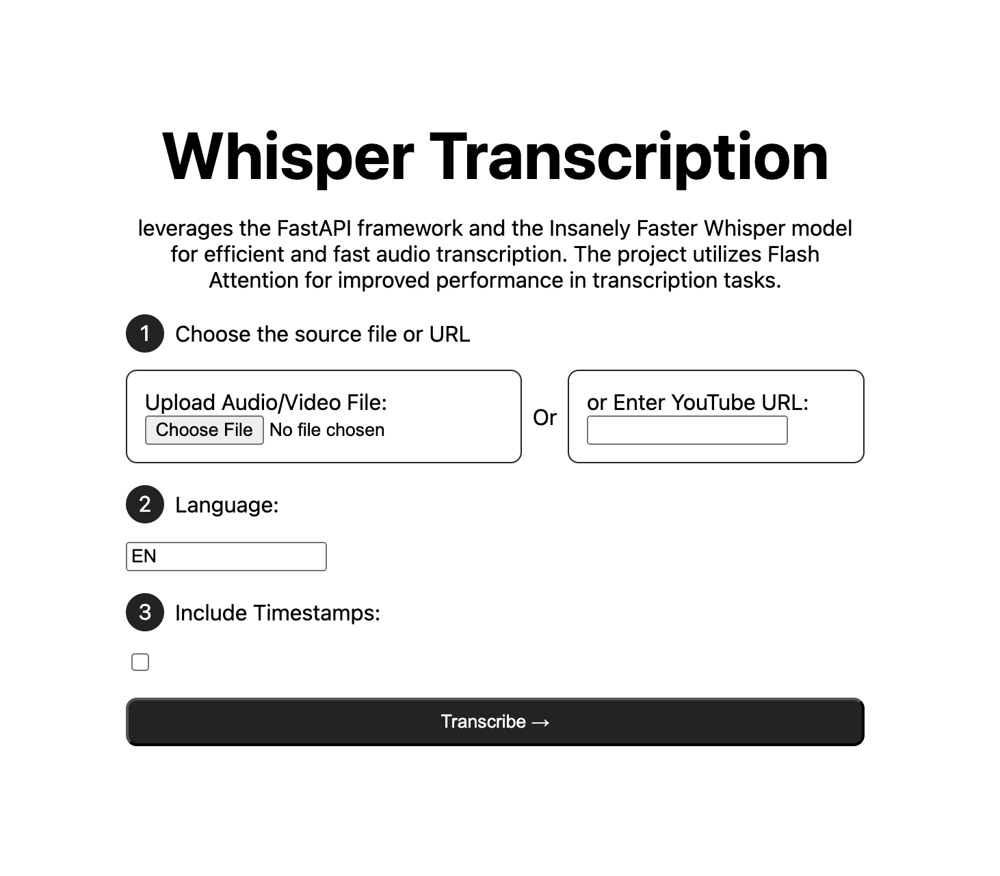
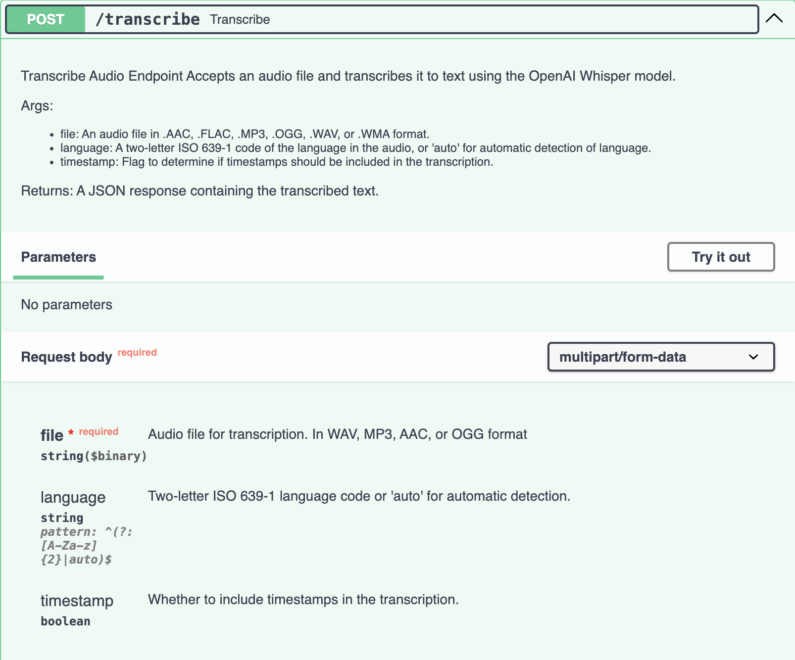

# FastAPI Insanely Faster Whisper Transcription





## Overview

This is a simple Python project that leverages the FastAPI framework and the Insanely Faster Whisper model for efficient and fast audio transcription. The project utilizes Flash Attention for improved performance in transcription tasks.


## Requirements

- Python 3.11
- [FastAPI](https://fastapi.tiangolo.com/)
- [Torch](https://pytorch.org/)
- [Torchaudio](https://pytorch.org/)
- [Transformers](https://huggingface.co/transformers/)
- [Optimum](https://optimum.readthedocs.io/)
- [Insanely Faster Whisper 0.0.13](https://pypi.org/project/insanely-fast-whisper/)
- FFmpeg (binary _see start.sh_)


## API Endpoint

### Transcribe

- **Endpoint:** `/transcribe`
- **Method:** POST
- **Parameters:**
  - `file`: An audio file in .AAC, .FLAC, .MP3, .OGG, .WAV, or .WMA format.
  - `language`: (Optional) A two-letter ISO 639-1 code of the language in the audio, or 'auto' for automatic detection of language. Default is 'EN'
  - `timestamp`: (Optional) Flag to determine if timestamps should be included in the transcription. Default is False

#### Example Usage

```python
import requests

files = {'file': ('audio.wav', open('path/to/audio.wav', 'rb'))}
response = requests.post("http://127.0.0.1:8000/transcribe", files=files)

print(response.json())
```

## Getting Started for development

1. Clone the repository:

```bash
git clone https://github.com/vikramsoni2/insanely_faster_whisper_api.git
cd insanely_faster_whisper_api
```

2. Create a new virtual environment and activate it:

```bash
python -m venv venv
source venv/bin/activate
```


3. Install dependencies:

```bash
sudo apt update && sudo apt install ffmpeg
pip install -r requirements.txt
```

4. Run the FastAPI application:

```bash
python main.py
```

The application will be accessible at `http://127.0.0.1:8000`.
